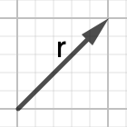
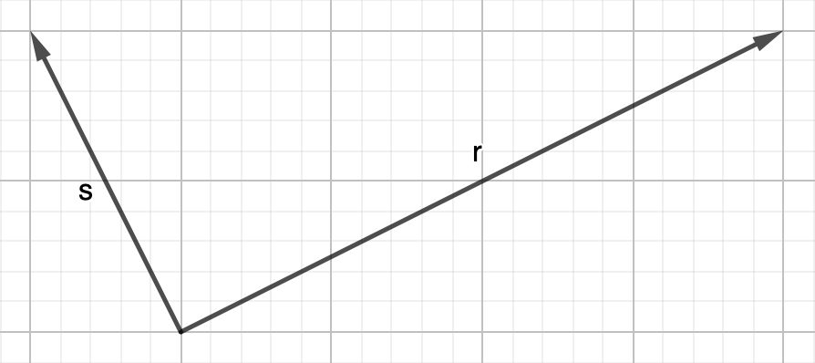
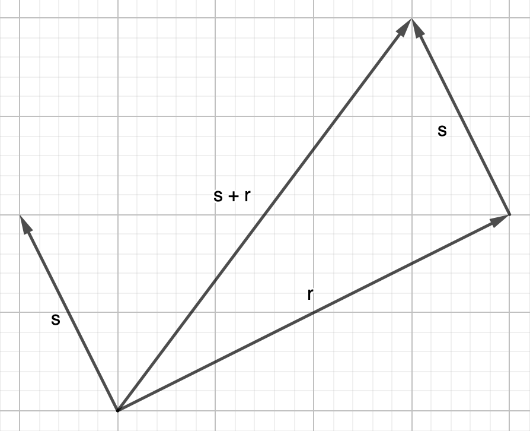

# Mathematics for Machine Learning: Linear Algebra

> Notes on David Dye's [course on Mathematics for Machine Learning: Linear Algebra](https://www.coursera.org/learn/linear-algebra-machine-learning)

## Introduction: Solving data science challenges with mathematics

A matrix is labeled with parentheses:
$$
\left(\begin{array}{cc}
1 & 2 \\
3 & 4
\end{array}\right)
$$

And a vector is labeled with brackets

$$
\begin{bmatrix}
1 \\
2
\end{bmatrix}
$$

For example,

$$
2a + 3b = 8 \\
10a + 1b = 13 \\
$$

becomes

$$
\left(
    \begin{array}{cc}
    2 & 3 \\
    10 & 1
    \end{array}\right
)
\begin{bmatrix}
a \\
b
\end{bmatrix}
=
\begin{bmatrix}
8 \\
13
\end{bmatrix}
$$

## Vectors

A vector is an object that moves us across space, whether that be physical or a data space.

While in physics, it would describe how we are moving through space, in data science it describes an object.

### Adding and Subtracting Vectors
When adding vectors together, you receive the endpoint of both arrows appended together.

For example, take vector $r$ and $s$:

If we were to add these two vectors together, than we just need to move one of the vectors to the endpoint of the other vector.

If we were to represent this with numbers, we would have $r$ and $s$:

$$
r = 
\begin{bmatrix}
4 \\
2
\end{bmatrix}

s =
\begin{bmatrix}
-1 \\
2
\end{bmatrix}
$$

Now when we add them, we pretty much just add across the vectors:

$$
r + s =

\begin{bmatrix}
4 \\
2
\end{bmatrix} 
+
\begin{bmatrix}
-1 \\
2
\end{bmatrix}

=

\begin{bmatrix}
4 + -1 \\
2 + 2
\end{bmatrix}

=

\begin{bmatrix}
3 \\
4
\end{bmatrix}
$$

Same things with the signs flipped for subtracting vectors.

### Multiplying Vectors

Just apply it to each number in the vector, look at $r$ it would look like this:

$$
2r = 

2
\begin{bmatrix}
4 \\
2
\end{bmatrix}

=

\begin{bmatrix}
8 \\
4
\end{bmatrix}